## Confianza institucional como forma de legitimidad democratica en America Latina

##  {.smaller}

Dentro de nuestro contexto de America Latina, hemos presenciado una alta variabilidad en los tipos de gobierno dentro de la region, existiendo una disparidad constante entre los sectores politicos de izquierda y los sectores politicos de derecha. Teniendo en cuenta esto, se observa que en los ultimos años los gobiernos de cada pais van cambiando de un sector a otro dependiendo de sus contextos especificos de cada pais. Tenemos los ejemplos de Brazil de un paso de un gobierno de derecha a izquierda, Chile de un gobierno de derecha a izquierda, o teniendo en cuenta mas el aspecto contemporaneos cambios de izquierda a derecha. La crecion de un indice nos permite aproximar dimensiones de legitimidad y satisfacción democrática mediante confianza institucional

Para efectos de este trabajo entonces, buscamos aproximarnos, a demostrar como la confianza en las instituciones pueden permitir la posibilidad de que se genere una mayor legitimidad y satisfaccion con el sistema democratico. Ya planteaba Cereceda-Marambio que los regímenes democráticos se encuentran ligados al prestigio de las instituciones, dado que cada sociedad posee un orden particular constituido por diversas instituciones políticas, económicas, sociales y culturales que cumplen determinadas funciones, por lo que es importante la valoración que dan los ciudadanos a estas instituciones como parte misma del proceso de construcción de la democracia.

## Variables trabajadas

Para el desarrollo de esta investigación, se utilizará como fuente de datos la encuesta de Latinobarómetro correspondiente al año 2020. A partir de esta base de datos, se construirá un índice de confianza institucional compuesto por variables asociadas a la confianza en instituciones políticas y estatales, tales como el Congreso, las Fuerzas Armadas, la policía, el Poder Judicial y la institución electoral, el sexo como variable de control y adicional para la realizacion de regresion logistica se agrega la variable de situacion economica. Nuestro objetivo tambien será analizar cómo varía este índice según la posición política de los encuestados.

## Descriptivos

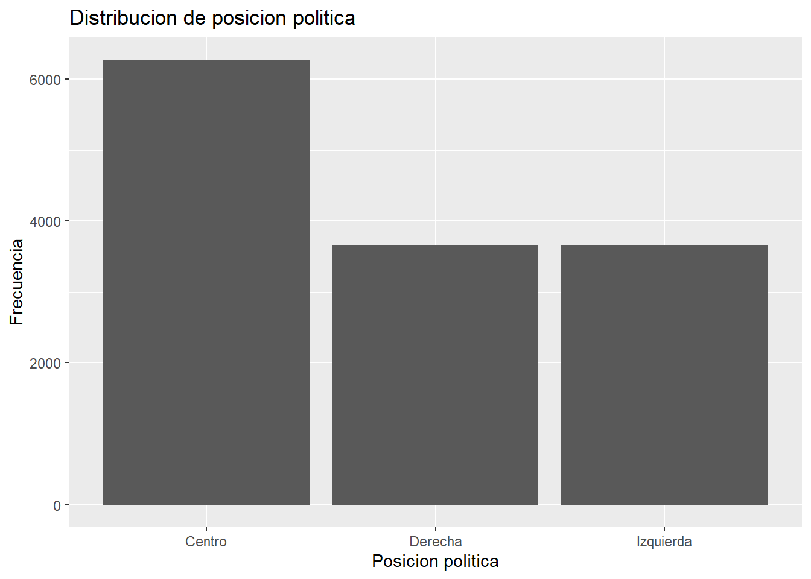

## Descriptivos

:::: {.columns}

::: {.column width="50%"}
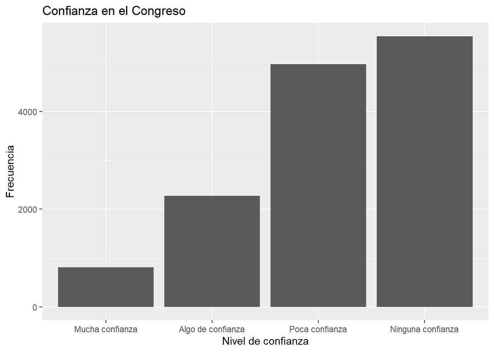
:::

::: {.column width="50%"}
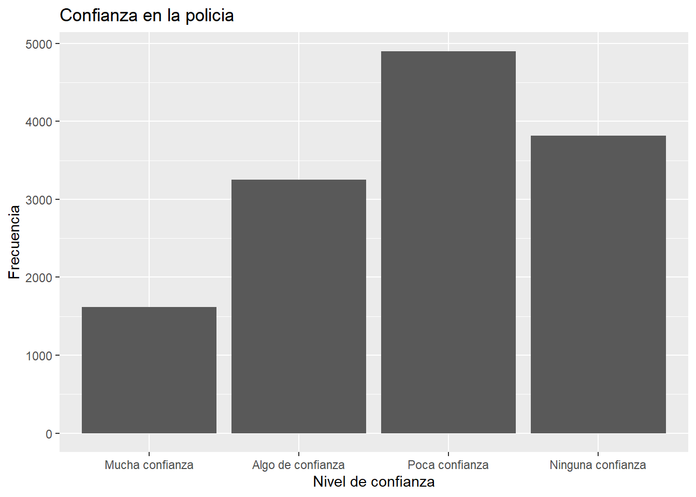
:::

::::

## Descriptivos

:::: {.columns}

::: {.column width="50%"}
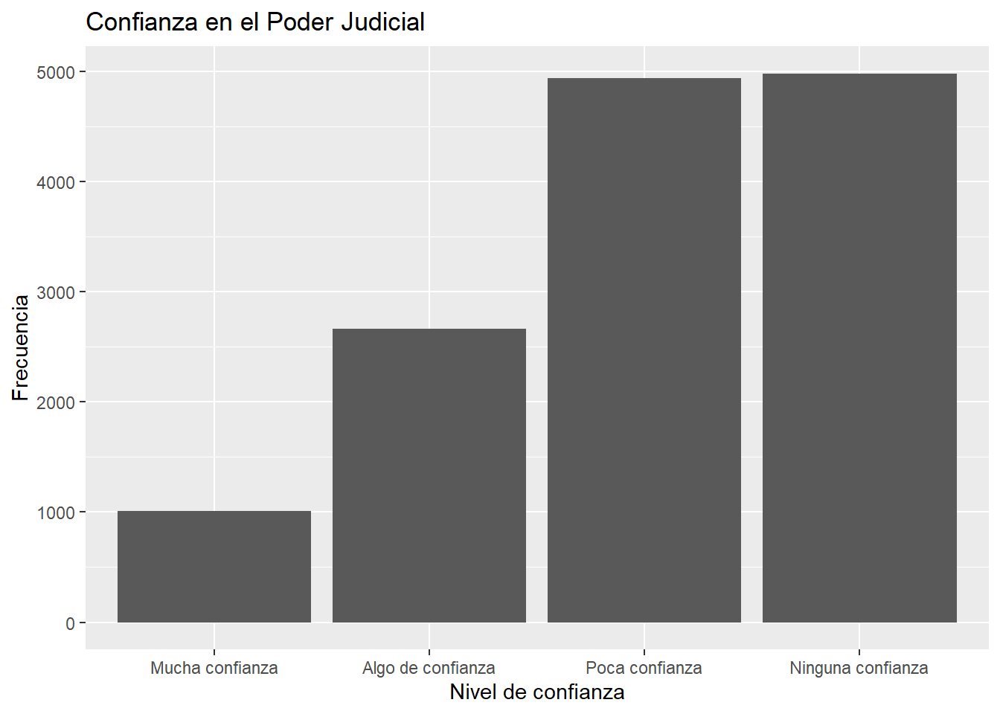
:::

::: {.column width="50%"}
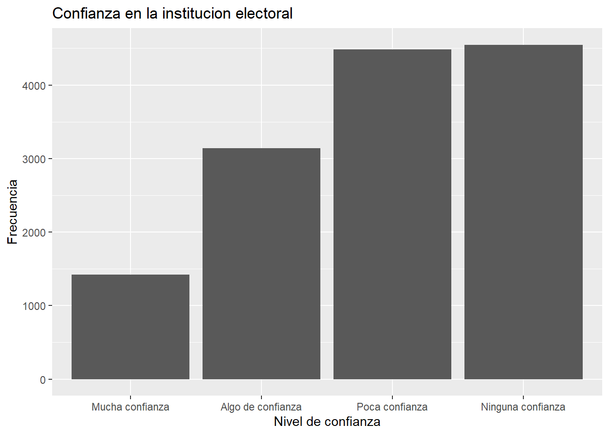
:::

::::

## Descriptivos

:::: {.columns}

::: {.column width="50%"}
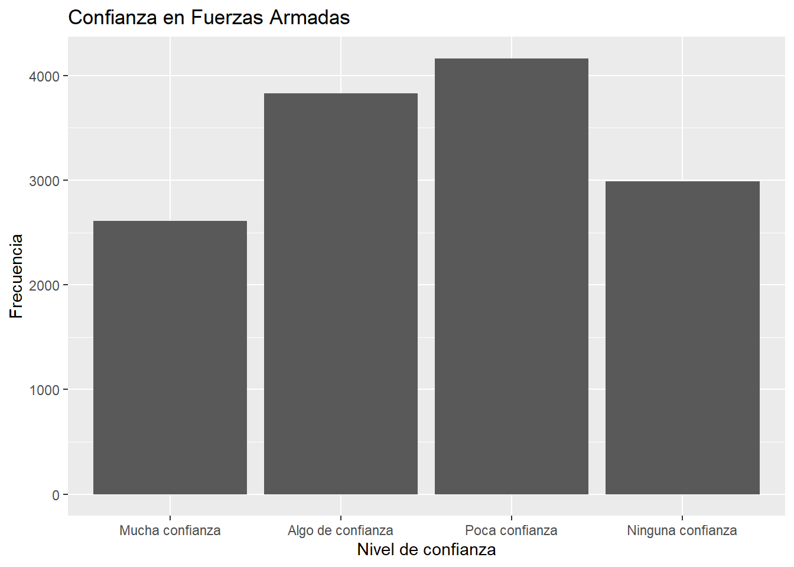
:::

::: {.column width="50%"}

:::

::::

## Pequeño analisis de los descriptivos {.smaller}

En términos generales, con los resultados obtenidos, podemos observar que también podrían estar reflejando bajos niveles de satisfacción con el funcionamiento de la democracia en América Latina. La predominancia de respuestas asociadas a “poca confianza” y “ninguna confianza” en instituciones centrales del sistema democrático podría interpretarse como una señal de debilitamiento de la legitimidad institucional y de percepciones críticas respecto del desempeño democrático. En este sentido, la baja confianza institucional no necesariamente implica un rechazo a la democracia como régimen político, pero sí podría evidenciar insatisfacción con la manera en que las instituciones democráticas estarian operando y representando a las personas de la region.

## Correlaciones {.smaller}

:::: {.columns}

::: {.column width="50%"}
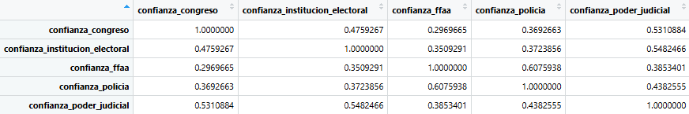
:::

::: {.column width="50%"}
La correlación entre las variables utilizadas para la construcción del índice, se observa que todas presentan asociaciones positivas entre sí. Esto nos hace entender que las correlaciones observadas son moderadas y coherentes teóricamente, al no presentarse numeros negativos se sugiere que las variables seleccionadas logran captar una dimensión común asociada, donde apuntan hacia la misma direccion. Adicionalmente podemos observar que las correlaciones entre variables oscilan entre los 0.30 y los 0.60 por lo que presentan un nivel moderado, tienden a medir esta dimension en comun asociada a la confianza institucional.
:::

::::

## Creacion de indice {.smaller}

Con el objetivo de sintetizar las variables incluidas en este estudio, se procedió a construir un índice de confianza institucional compuesto por indicadores asociados a la confianza en distintas instituciones políticas y estatales. Para ello, se seleccionaron las variables correspondientes a confianza en el Congreso, institución electoral, Fuerzas Armadas, policía y Poder Judicial. Posteriormente, las variables fueron recodificadas de manera que los valores más bajos representaran mayores niveles de confianza institucional, mientras que los valores más altos indicaran menores niveles de confianza.

Posteriormente, se evaluó la consistencia interna del índice mediante el coeficiente alfa de Cronbach, obteniendo un resultado de 0.79, llevandonos a observar que nos estaria indicando que los indicadores utilizados logran medir de manera consistente una dimensión común vinculada a la confianza institucional.

## Indice {.smaller}

:::: {.columns}

::: {.column width="50%"}
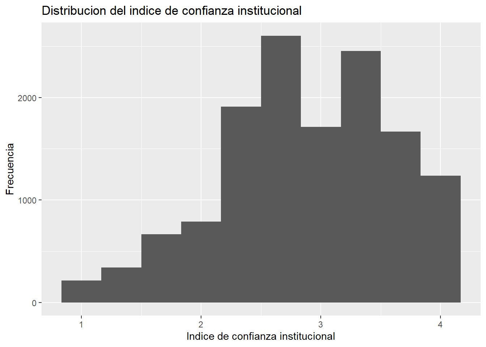
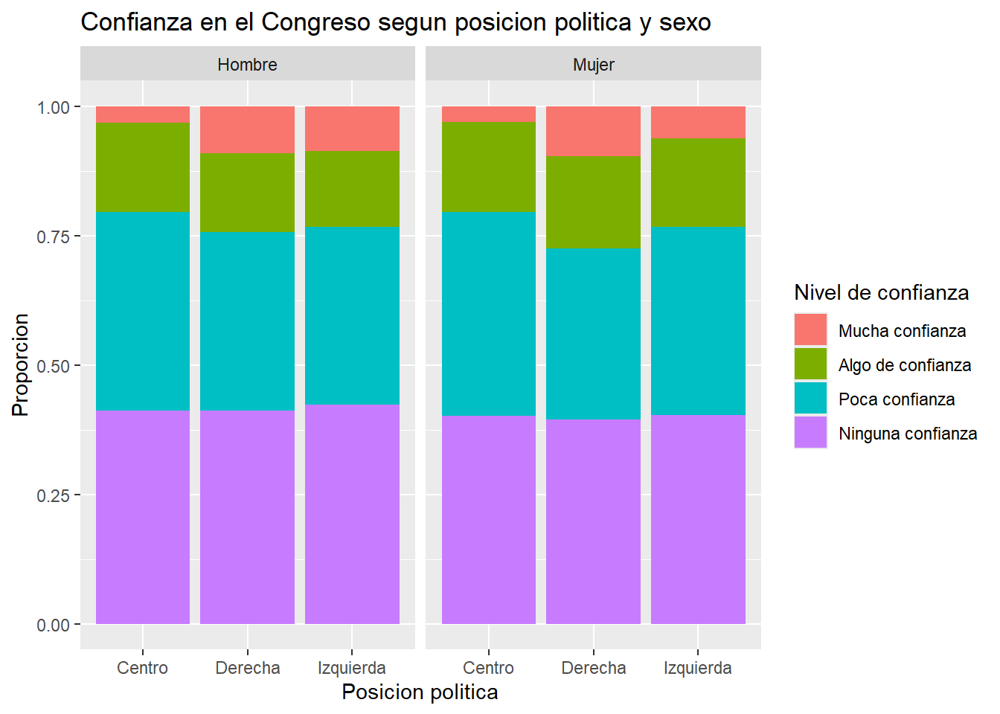
:::

::: {.column width="50%"}
Los resultados descriptivos del índice muestran niveles relativamente bajos de confianza institucional en la muestra analizada. En términos generales, predominan percepciones críticas hacia distintas instituciones políticas y estatales, especialmente aquellas vinculadas al sistema representativo como lo es el congreso y el poder judicial. Esto podría reflejar menores niveles de legitimidad percibida del funcionamiento democrático en América Latina, considerando que la confianza institucional constituye una dimensión relevante para la satisfacción y evaluación del sistema democrático por parte de la ciudadanía.
:::

::::

## Relacion con posicion politica {.smaller}

En este caso podemos observar que existe una relacion muy debil entre ambas variables (-0.07850316) (confianza institucional y posicion politica) la cual nos permite comprender que la posicion politica de los encuestados no se relaciona de manera importante con los niveles de confianza institucional. Se puede inferir por la correlacion negativa que la magnitud del coeficiente es extremadamente baja, la asociacion que buscamos observar es inexistente. Considerando que el índice fue recodificado de manera que valores más bajos representan mayor confianza institucional, el resultado podría sugerir que los sectores de derecha presentan niveles ligeramente mayores de confianza en las instituciones respecto de los sectores de izquierda. Sin embargo, la intensidad de esta relación es muy pequeña, por lo que no puede afirmarse que la orientación ideológica sea un factor determinante en la confianza institucional dentro de la muestra analizada.Si bien podemos tambien descifrar que a pesar de haber separado tambien por sexo la muestra, se presenta una especie de homogeneidad en los resultados, al observar que la sensacion de poca confianza con las instituciones se mantiene a pesar de buscar relacionarlo con otras variables.

## Primeras conclusiones {.smaller}

* La confianza institucional en América Latina presenta niveles bajos, especialmente en el Congreso y el Poder Judicial, donde predominan las respuestas de “poca” o “ninguna confianza”.

* Las Fuerzas Armadas y, en menor medida, la policía muestran niveles comparativamente más altos, aunque la desconfianza sigue siendo una tendencia general.

* El índice construido mostró una adecuada consistencia interna, permitiendo sintetizar una dimensión común de confianza institucional.

* La posición política y el género no parecen explicar de manera sustantiva las diferencias en los niveles de confianza: la desconfianza se observa de forma transversal entre los distintos grupos.

* Estos resultados sugieren una evaluación crítica del funcionamiento concreto de las instituciones democráticas, más que un rechazo directo a la democracia como régimen político.

## Regresion Lineal {.smaller}

:::: {.columns}

::: {.column width="50%"}
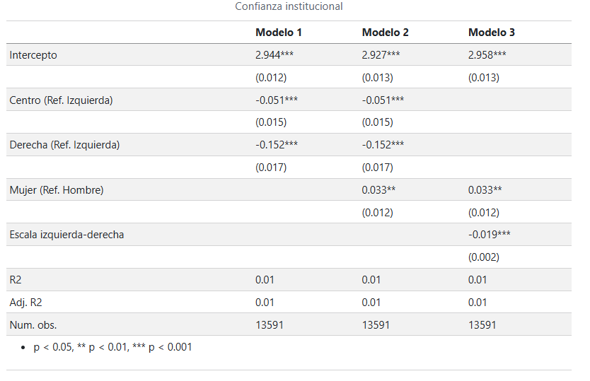
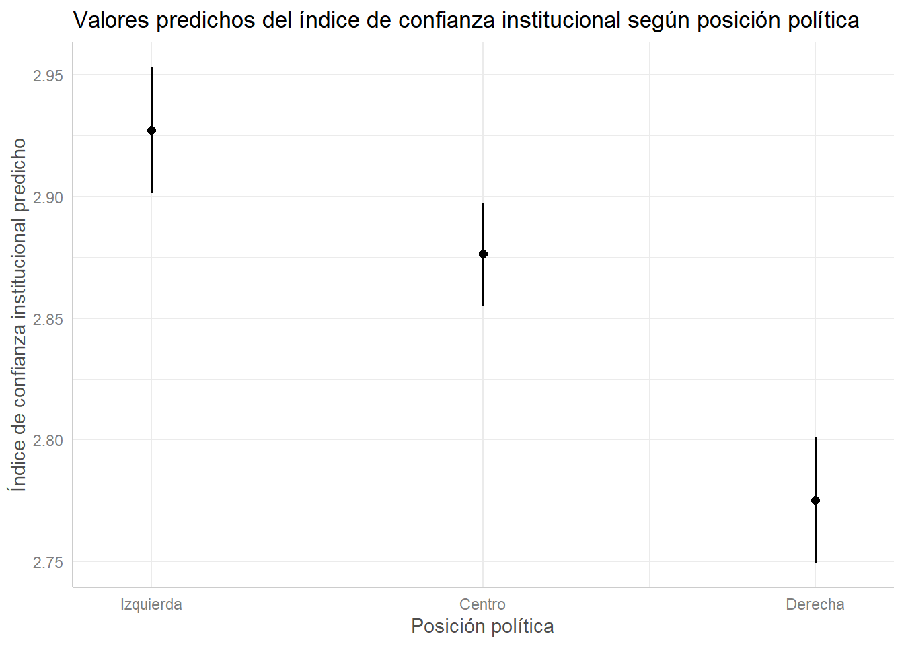
:::

::: {.column width="50%"}
El gráfico de valores predichos permite observar las diferencias estimadas en el índice de confianza institucional según posición política. Como el índice mantiene su escala original, los valores más bajos indican mayores niveles de confianza institucional. En este sentido, si los valores predichos para centro y derecha son menores que los de izquierda, esto refuerza la interpretación de que estos grupos presentan mayores niveles estimados de confianza institucional. No obstante, las diferencias observadas son pequeñas, por lo que deben interpretarse con cautela.

:::

::::

## Pequeño analisis

La categoría de referencia es la izquierda política.
Centro y derecha presentan coeficientes negativos y significativos, lo que indica mayor confianza institucional en comparación con la izquierda, ya que valores más bajos del índice representan mayor confianza.
Al controlar por sexo, esta relación se mantiene prácticamente igual.
Las mujeres presentan niveles levemente menores de confianza institucional que los hombres.
A medida que aumenta la posición hacia la derecha, también aumenta la confianza institucional.
Sin embargo, los valores de R² son bajos, por lo que estas variables explican solo una parte reducida de la confianza institucional.

## Regresion logistica 

Se creó una variable binaria de alta confianza institucional, diferenciando entre personas con alta confianza y quienes presentan niveles bajos o medios.
La mayoría de la muestra se concentra en niveles bajos o medios de confianza (85,2%), mientras que un 14,8% presenta alta confianza institucional.
Se estimaron tres modelos:
1- Posición política.
2- Posición política + sexo.
3- Posición política + sexo + situación económica actual.
El tercer modelo cumple con el criterio de incluir al menos tres variables independientes.

## Regresion logistica {.smaller}

:::: {.columns}

::: {.column width="50%"}
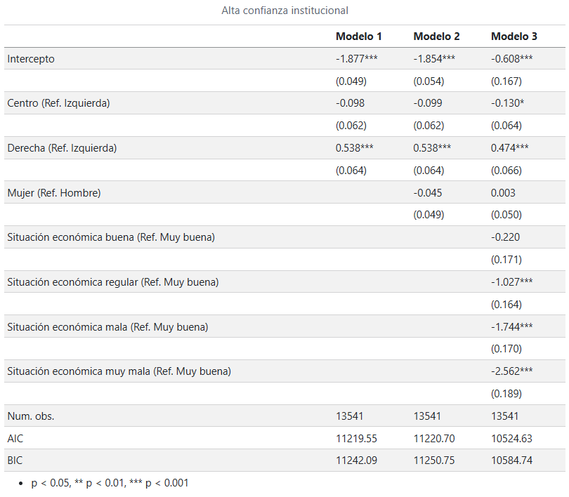
:::

::: {.column width="50%"}
Las categorías de referencia son: izquierda, hombres y situación económica muy buena.

Los resultados de centro y derecha se interpretan en comparación con las personas de izquierda.

Un coeficiente positivo indica una mayor probabilidad de presentar alta confianza institucional; un coeficiente negativo, una menor probabilidad.

:::

::::

## Conclusiones finales y cierre {.smaller}

En conclusión, la confianza institucional en América Latina presenta niveles bajos, especialmente en instituciones como el Congreso y el Poder Judicial. El índice construido mostró una consistencia adecuada para resumir esta dimensión y permitió analizar sus relaciones con distintas variables. Aunque la posición política presenta una asociación estadísticamente significativa con la confianza institucional, su capacidad explicativa es reducida: las personas ubicadas más hacia la derecha tienden a mostrar una confianza levemente mayor que quienes se identifican con la izquierda. Además, una peor evaluación de la situación económica se relaciona con una menor probabilidad de presentar alta confianza institucional. En conjunto, los resultados sugieren que la desconfianza hacia las instituciones es un fenómeno amplio y relativamente transversal, que no implica necesariamente un rechazo a la democracia, sino una evaluación crítica sobre el funcionamiento concreto de sus instituciones.

